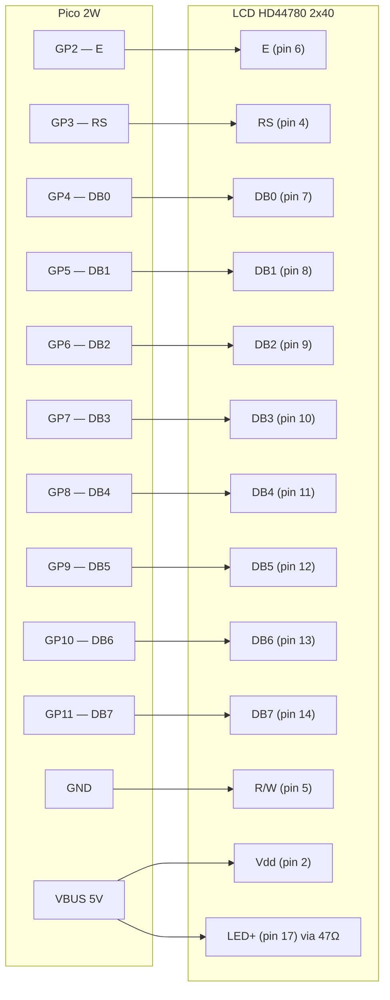
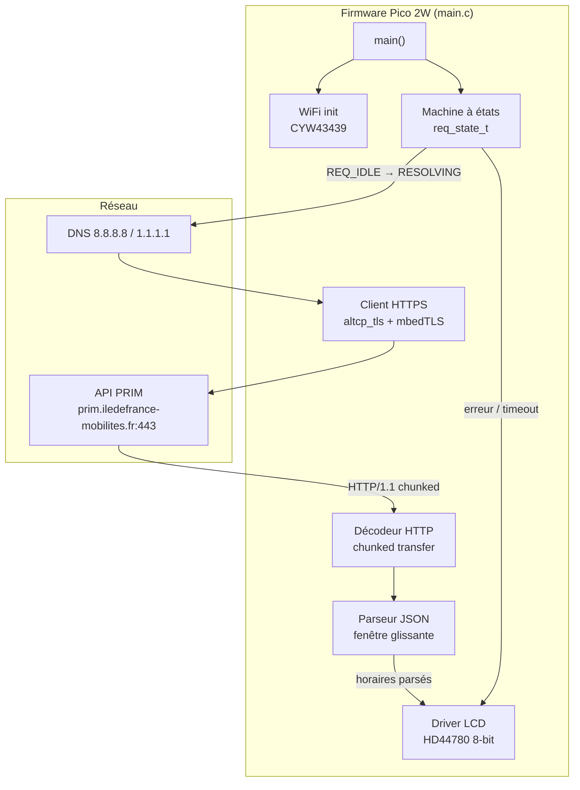
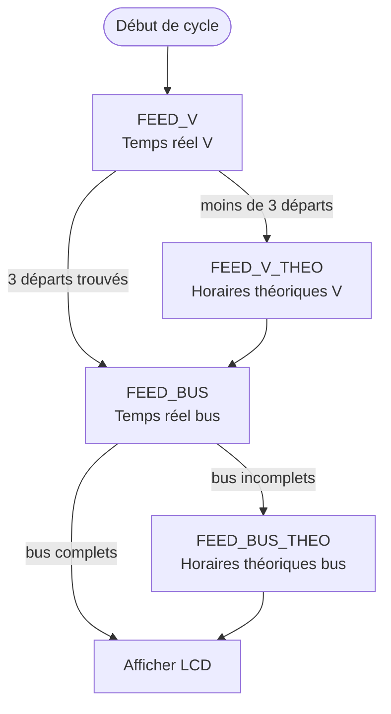
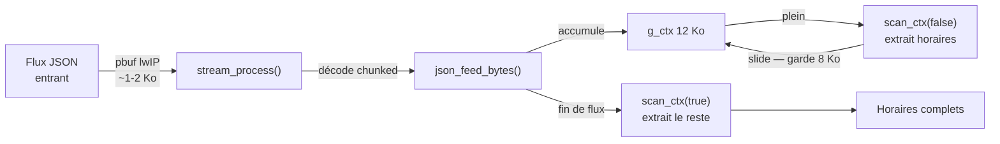
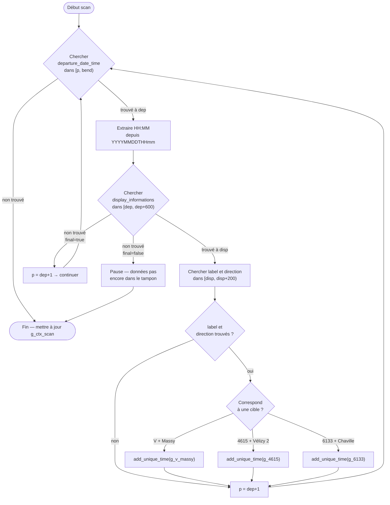
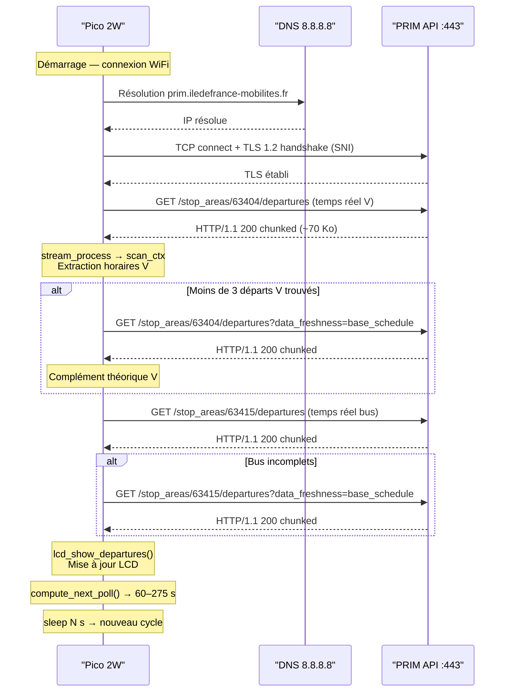
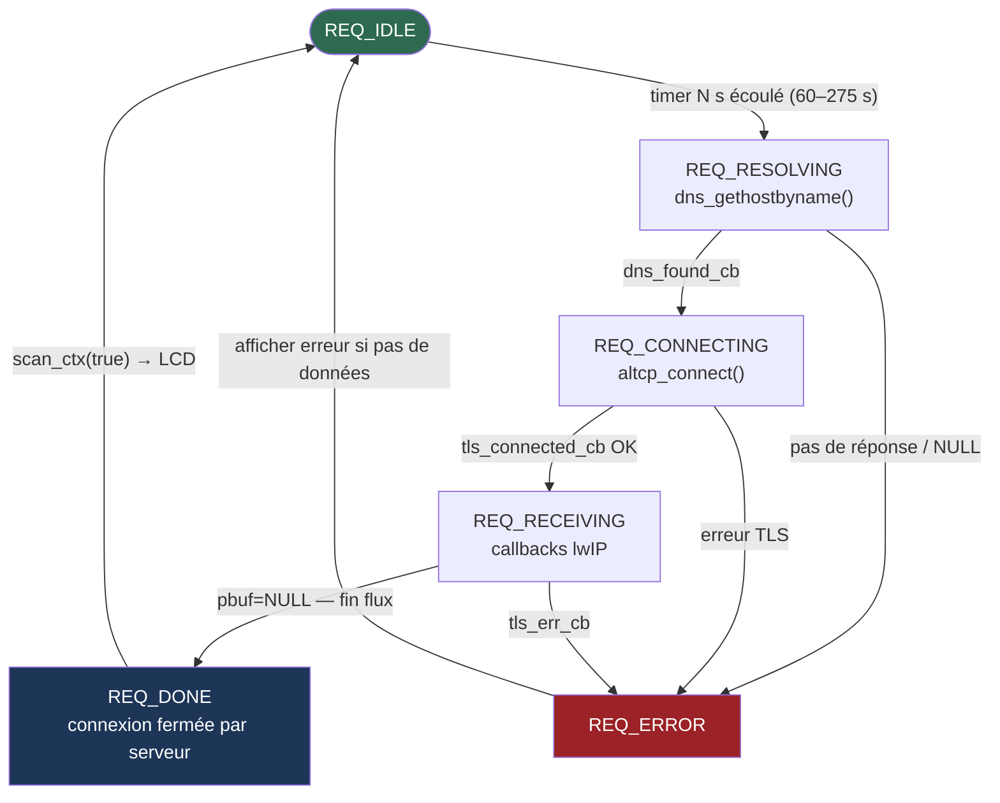

# transilien_lcd

Panneau d'affichage temps réel des prochains départs Transilien et bus sur un écran LCD 2×40,
piloté par un Raspberry Pi Pico 2W. Les horaires sont interrogés dynamiquement via
l'API PRIM d'Île-de-France Mobilités, avec un intervalle de 1 à 4 min 35 s selon l'imminence
des prochains départs, dans la limite de 1 000 requêtes/jour.

```
╔════════════════════════════════════════╗
║ V>MASSY 19:59 20:29 20:44              ║
║ 4615 20:03 20:33 | 6133 20:14 20:44    ║
╚════════════════════════════════════════╝
```

---

## Sommaire

1. [Contexte et objectif](#1-contexte-et-objectif)
2. [Matériel](#2-matériel)
3. [Architecture logicielle](#3-architecture-logicielle)
4. [API PRIM — Navitia](#4-api-prim--navitia)
5. [Stratégie de parsage en streaming](#5-stratégie-de-parsage-en-streaming)
6. [Parseur JSON en streaming](#6-parseur-json-en-streaming)
7. [Séquence réseau complète](#7-séquence-réseau-complète)
8. [Machine à états des requêtes](#8-machine-à-états-des-requêtes)
9. [Affichage LCD](#9-affichage-lcd)
10. [Fichiers du projet](#10-fichiers-du-projet)
11. [Mise en route](#11-mise-en-route)
12. [Script de validation Python](#12-script-de-validation-python)
13. [Gestion du quota API](#13-gestion-du-quota-api)

---

## 1. Contexte et objectif

Le projet naît d'un besoin simple : voir en un coup d'œil, chez soi, les prochains départs
depuis Bièvres sans sortir son téléphone.

**Lignes affichées :**

| Ligne | Direction | Arrêt | Slots |
|-------|-----------|-------|-------|
| Transilien V | → Massy-Palaiseau | Bièvres | 3 prochains |
| Bus 4615 | → Vélizy 2 | Mairie de Bièvres | 2 prochains |
| Bus 6133 | → Gare de Chaville Rive Droite | Mairie de Bièvres | 2 prochains |

L'afficheur est mis à jour avec un intervalle **dynamique** entre 60 s et 4 min 35 s,
selon l'imminence du prochain départ. En cas d'erreur réseau, le dernier affichage
reste visible jusqu'au prochain cycle réussi.

---

## 2. Matériel

### Raspberry Pi Pico 2W

| Propriété | Valeur |
|-----------|--------|
| SoC | RP2350 (dual Cortex-M33, 264 Ko RAM, 2 Mo Flash) |
| WiFi | CYW43439 (802.11n, 2.4 GHz) |
| SDK | pico-sdk v2.2, `PICO_BOARD=pico2_w` |

### Afficheur LCD

| Propriété | Valeur |
|-----------|--------|
| Référence | Midas MC24005AA6W9-BNMLW-V2 (Farnell 301-3431) |
| Contrôleur | ST7066U — compatible HD44780 |
| Format | 2 lignes × 40 colonnes |
| Interface | Parallèle 8 bits |
| Alimentation | Vdd = 5 V (backlight via 47 Ω), logique 3.3 V compatible |

### Câblage Pico 2W → LCD



> **Note :** R/W est câblé à GND de façon permanente (écriture seule). Les GPIO 3.3 V du
> RP2350 ne reçoivent donc jamais de tension 5 V venant du LCD.

---

## 3. Architecture logicielle



Le firmware tourne en **boucle principale single-thread** (`while(true)` avec `sleep_ms(100)`).
Le réseau est géré par `cyw43_arch_lwip_threadsafe_background` : lwIP s'exécute dans les
interruptions, les callbacks arrivent dans le contexte principal protégé par
`cyw43_arch_lwip_begin/end`.

---

## 4. API PRIM — Navitia

L'API utilisée est [PRIM](https://data.iledefrance-mobilites.fr) d'Île-de-France Mobilités,
qui expose une interface Navitia.

**Endpoint :**
```
GET https://prim.iledefrance-mobilites.fr/marketplace/v2/navitia/
    stop_areas/{stop_id}/departures
    ?count=40&duration=10800[&data_freshness=base_schedule]
```

| Paramètre | Valeur |
|-----------|--------|
| Stop V (Bièvres Transilien) | `stop_area:IDFM:63404` |
| Stop bus (Mairie de Bièvres) | `stop_area:IDFM:63415` |
| `duration` | 10800 s = 3 h |
| `count` | 40 (temps réel) / 40 (horaires théoriques) |
| Authentification | En-tête HTTP `apikey: <PRIM_API_KEY>` |

### Stratégie de requêtes en 4 étapes

La machine à états enchaîne jusqu'à 4 requêtes HTTPS par cycle pour garantir 3 départs V
et 2 départs par bus même quand le temps réel est lacunaire :



La réponse JSON pèse environ **60–80 Ko** par requête. Elle arrive en **chunked transfer
encoding** sur une connexion HTTPS/TLS 1.2.

### Structure d'un objet `departure` dans la réponse

Chaque entrée du tableau `departures[]` suit cet ordre de champs :

```
{
  "route": { ... },
  "stop_point": { ... },
  "stop_date_time": {
    "departure_date_time": "20260423T195900",   ← ancre du parseur (+0)
    "base_departure_date_time": "...",
    ...
  },
  "display_informations": {                      ← ~440 octets plus loin
    "direction": "Massy - Palaiseau (Massy)",
    "label": "V",
    ...
  },
  "links": [ ... ]
}
```

> **Point crucial :** `departure_date_time` précède `display_informations` d'environ
> 440 octets (mesuré sur données réelles). Le parseur suit cet ordre — toute inversion
> produirait des horaires erronés.

---

## 5. Stratégie de parsage en streaming

### Pourquoi ne pas simplement tout stocker puis parser ?

Deux raisons rendent cela impraticable, même si la réponse JSON (~70 Ko) est
théoriquement plus petite que les 264 Ko de RAM totaux du RP2350 :

**Raison 1 — lwIP ne livre jamais tout d'un coup.**
La réponse arrive dans des callbacks `tls_recv_cb` sous forme de `pbuf` de ~1–2 Ko,
au fil de la réception TCP. Il n'existe pas de moment où "tout est arrivé, maintenant
je parse" — le seul signal de fin est la fermeture de connexion par le serveur
(`pbuf == NULL`). Il faut donc traiter chaque morceau à mesure qu'il arrive.

**Raison 2 — La RAM disponible est bien inférieure à 264 Ko.**
Une fois le firmware chargé, la pile TLS/lwIP monopolise une large part de la RAM :

| Zone | Taille |
|------|--------|
| Heap lwIP (`MEM_SIZE`) | 32 Ko |
| Contexte mbedTLS + buffers TLS record | ~20–30 Ko |
| Code `.bss` / `.data` / pile | ~20 Ko |
| **Disponible pour l'application** | **~180 Ko** |

Allouer un buffer statique de 80 Ko pour le JSON brut serait faisable mais consommerait
presque la moitié de ce qui reste, sans aucun bénéfice puisque lwIP impose de toute
façon un traitement en flux.

### La fenêtre glissante — principe illustré

Le parseur maintient un tampon de **12 Ko** (`g_ctx`) dans lequel les octets JSON
déchiffrés s'accumulent. Lorsque ce tampon est plein, les données déjà analysées sont
écartées et les **8 Ko les plus récents** sont conservés (pour ne pas perdre un pattern
à cheval sur deux fenêtres). Le tout en **un seul passage** sur la réponse — aucune
requête supplémentaire.

**Exemple avec un flux fictif de 30 Ko simplifié :**

```
Réponse JSON complète (70 Ko)
══════════════════════════════════════════════════════════════════════════
│ obj1 │ obj2 │ obj3 │ obj4 │ obj5 │ obj6 │ ...  │ obj40 │
══════════════════════════════════════════════════════════════════════════

Étape 1 — les premiers 12 Ko arrivent, remplissent g_ctx :
┌───────────────────────────────────────┐
│    obj1    │    obj2    │    obj3     │  ← g_ctx (12 Ko)
└───────────────────────────────────────┘
 scan_ctx(false) : extrait obj1, obj2, obj3 complets
 → slide : on jette les 4 premiers Ko, on garde les 8 derniers

Étape 2 — 4 Ko supplémentaires arrivent :
┌───────────────────────────────────────┐
│  obj3(fin)  │  obj4  │  obj5  │  obj6 │  ← g_ctx
└───────────────────────────────────────┘
 scan_ctx(false) : extrait obj4, obj5 (obj6 peut être incomplet)
 → slide à nouveau ...

Étape N — fin de flux (connexion fermée) :
 scan_ctx(true) : extrait tout ce qui reste, même incomplet
```

Le lookback de 8 Ko garantit que le pattern `"departure_date_time"` → `"display_informations"`
(~440 octets d'écart) n'est jamais coupé entre deux fenêtres.



| Constante | Valeur | Rôle |
|-----------|--------|------|
| `CTX_SIZE` | 12 288 o | Taille de la fenêtre de scan active |
| `LOOKBACK_SIZE` | 8 192 o | Portion conservée lors du glissement |
| `MEM_SIZE` (lwIP) | 32 768 o | Heap lwIP pour pbuf, TLS, TCP |

---

## 6. Parseur JSON en streaming

Le parseur **ne charge pas de bibliothèque JSON**. Il effectue des recherches de sous-chaînes
bornées (`bstrstr`) dans la fenêtre glissante, en suivant la structure exacte des objets
Navitia.

### Algorithme de `scan_ctx`



### Distances mesurées sur données réelles

| Pattern → Pattern | Distance |
|-------------------|----------|
| `"departure_date_time":"` → `"display_informations":{` | ~440 o (440–445 o observés) |
| `"display_informations":{` → `"label":"` | ~130 o |
| `"display_informations":{` → `"direction":"` | ~84–128 o |

La constante `DEP_TO_DISP_MAX = 600` laisse une marge de ~33 % par rapport à la distance
maximale observée.

### Extraction de l'heure

L'API Navitia retourne les timestamps au format compact **Navitia local** :
```
YYYYMMDDTHHmm[SS]   ex: 20260423T195900
```

La fonction `extract_navitia_hhmm` extrait directement les caractères 9–12 (HH et mm)
sans conversion de fuseau — les horaires sont déjà en heure locale française.

> Une fonction `iso_to_paris_hhmm` complète (conversion UTC → Europe/Paris avec gestion DST)
> est présente dans le code pour une éventuelle utilisation avec d'autres endpoints ISO 8601.

---

## 7. Séquence réseau complète



**Points notables :**

- Le DNS est forcé sur **8.8.8.8 / 1.1.1.1** au démarrage : les serveurs DNS de box
  domestiques répondent parfois mal aux requêtes lwIP (timeout observé en pratique).
- **SNI** (`mbedtls_ssl_set_hostname`) est obligatoire : le serveur héberge plusieurs
  certificats et ne présente le bon que si le nom d'hôte est indiqué dans le handshake.
- La vérification de certificat est **désactivée** (`altcp_tls_create_config_client(NULL, 0)`)
  : embarquer un CA store complet dépasserait le budget mémoire du Pico.
- Timeout global de 30 s par requête (`REQ_TIMEOUT_MS`) pour ne jamais rester bloqué.

---

## 8. Machine à états des requêtes



Les transitions `REQ_RESOLVING → REQ_CONNECTING` et `REQ_CONNECTING → REQ_RECEIVING`
déclenchent également le timeout de sécurité vérifié à chaque tour de boucle principale.

---

## 9. Affichage LCD

Le driver écrit directement sur les GPIO en mode 8 bits parallèle. Aucune bibliothèque
externe — les timing HD44780 sont respectés avec `sleep_us` / `sleep_ms`.

**Format des deux lignes :**

```
Ligne 0 : V>MASSY HH:MM HH:MM HH:MM          (31 chars sur 40)
Ligne 1 : 4615 HH:MM HH:MM | 6133 HH:MM HH:MM (39 chars sur 40)
```

Si un créneau n'est pas disponible (données insuffisantes ou erreur), `--:--` est affiché.

**États affichés pendant le démarrage :**

| Phase | Ligne 0 | Ligne 1 |
|-------|---------|---------|
| Connexion WiFi | `Connexion WiFi...` | SSID |
| WiFi échoué | `WiFi ECHEC` | — |
| Chargement API | `Chargement...` | `IP:x.x.x.x` |
| Erreur API | `Erreur API PRIM` | `Retry Ns E:<code>` |

---

## 10. Fichiers du projet

```
transilien_lcd/
├── main.c              Code principal (firmware Pico 2W)
├── CMakeLists.txt      Build system (pico-sdk, lwIP, mbedTLS)
├── lwipopts.h          Configuration lwIP (heap, TLS, TCP)
├── mbedtls_config.h    Configuration mbedTLS (ciph., courbes, TLS 1.2)
├── secrets.h           Credentials WiFi + clé API  ← ignoré par git
├── secrets.h.example   Template vide à copier
├── check_api.py        Script Python de validation des horaires
└── .gitignore
```

### Dépendances de compilation

| Bibliothèque | Source |
|---|---|
| `pico_stdlib` | pico-sdk |
| `pico_cyw43_arch_lwip_threadsafe_background` | pico-sdk |
| `pico_lwip_mbedtls` | pico-sdk (lwIP intégré) |
| `pico_mbedtls` | pico-sdk (mbedTLS intégré) |

---

## 11. Mise en route

### Prérequis

- [pico-sdk v2.2](https://github.com/raspberrypi/pico-sdk) installé dans `/opt/pico-sdk`
- `arm-none-eabi-gcc`, `cmake`, `ninja`
- OpenOCD RP2350 dans `/opt/openocd-rp2350` (pour flasher via Debug Probe)
- Clé API PRIM : [data.iledefrance-mobilites.fr](https://data.iledefrance-mobilites.fr)

### 1. Configurer les credentials

```bash
cp secrets.h.example secrets.h
# Éditer secrets.h avec votre SSID, mot de passe WiFi et clé PRIM
```

### 2. Compiler

```bash
export PICO_SDK_PATH=/opt/pico-sdk
mkdir build && cd build
cmake .. -G Ninja -DCMAKE_BUILD_TYPE=Release -DPICO_BOARD=pico2_w
ninja -j$(nproc)
```

### 3. Flasher via Debug Probe

```bash
/opt/openocd-rp2350/bin/openocd \
  -s /opt/openocd-rp2350/share/openocd/scripts \
  -f interface/cmsis-dap.cfg \
  -f target/rp2350.cfg \
  -c "adapter speed 5000" \
  -c "program build/transilien_lcd.elf verify reset exit"
```

---

## 12. Script de validation Python

`check_api.py` interroge la même API PRIM et affiche les horaires dans le terminal.
Il sert de référence pour valider que le parseur C produit les mêmes résultats.

```bash
export PRIM_API_KEY=votre_clé_ici
python check_api.py
```

```
Base Navitia: https://prim.iledefrance-mobilites.fr/marketplace/v2/navitia
Fenetre: 3h (10800s)
Heure locale: 2026-04-23 20:01:15 CEST

Transilien V -> Massy-Palaiseau
  Arret: Bièvres
  Horaires: 19:59 | 20:29 | 20:44 | 20:59 | 21:29

4615 -> Vélizy 2
  Arret: Mairie de Bièvres
  Horaires: 20:03 | 20:33 | 21:03 | 21:33

6133 -> Gare de Chaville Rive Droite
  Arret: Mairie de Bièvres
  Horaires: 20:14 | 20:44
```

Le script utilise une désérialisation JSON complète (`json.load`) — contrairement au
parseur C par scan de chaînes — ce qui en fait une référence fiable pour détecter
toute régression du firmware.

---

## 13. Gestion du quota API

L'API PRIM est limitée à **1 000 requêtes par jour**. Chaque cycle peut émettre
jusqu'à 4 requêtes HTTPS (V temps réel + V théorique + bus temps réel + bus théorique).

### Intervalle dynamique (`compute_next_poll`)

Après chaque cycle complet, l'intervalle avant le prochain cycle est calculé ainsi :

| Situation | Intervalle | Raison |
|---|---|---|
| Prochain départ ≤ 7 min (toutes lignes) | **60 s** (`MIN_POLL_MS`) | Temps réel utile, retard possible |
| Prochain départ > 7 min | `(δ × 60 − 120) s`, plafonné à **275 s** | Refresh 2 min avant le départ |
| Erreur réseau | 275 s (`MAX_POLL_MS`) | Attente conservatrice |
| Heure inconnue | 275 s | Pas encore synchronisé |
| Nuit (00 h – 04 h 59) | Cycle sauté | Toutes lignes à l'arrêt |

> Le seuil 7 min est défini par `URGENT_MIN`. Le délai d'anticipation de 2 min est
> défini par `LEAD_TIME_S`.

### Disjoncteur quotidien

Un compteur `g_daily_req_count` est incrémenté à chaque appel `start_fetch()`.
Lorsqu'il atteint **960** (`DAILY_REQ_LIMIT`), `compute_next_poll()` force
immédiatement `MAX_POLL_MS = 275 s` pour le reste de la journée, désactivant le
mode urgent. Le compteur est remis à zéro au passage de minuit, détecté d'après
l'en-tête HTTP `Date:`.

**Budget pire cas (tout en mode urgent 60 s) :**
$$\frac{960\text{ req}}{4\text{ req/cycle}} \times 60\text{ s} = 14\,400\text{ s} = 4\text{ h de mode urgent maximum}$$

**Budget normal (275 s constant, 19 h de service) :**
$$\frac{19 \times 3600}{275} \times 4 = 992\text{ req/jour} < 1000 \checkmark$$

---

## Licence

Projet personnel — usage libre.
